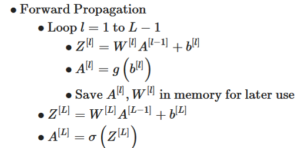
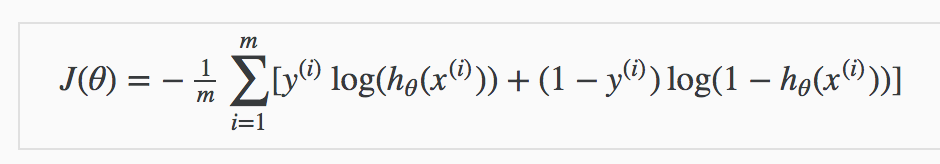
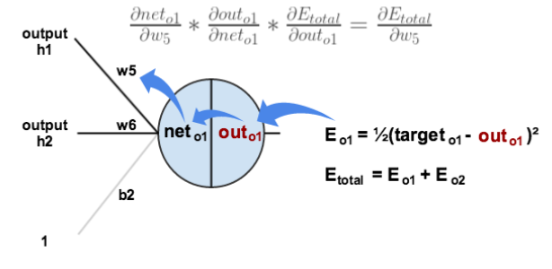
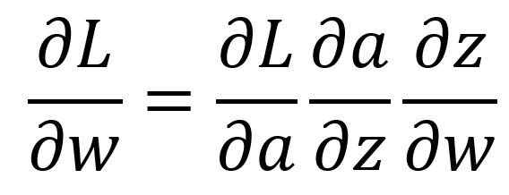
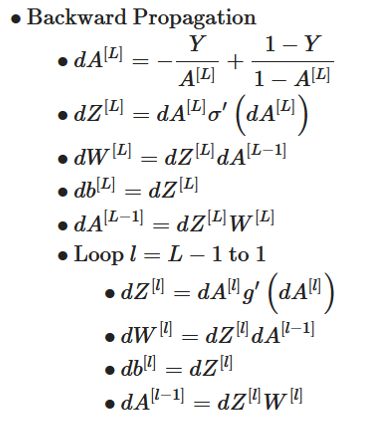
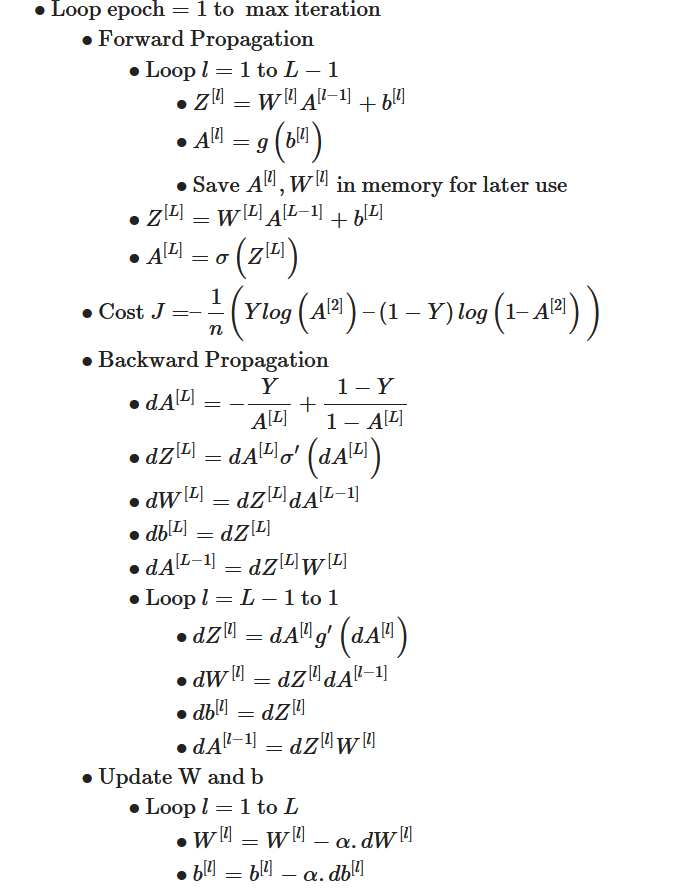
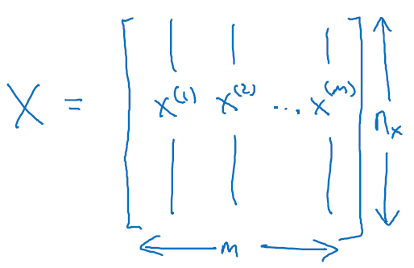

# Deep Neural Network
Python implementation of deep neural network  from scratch with a mathmatical approach. 
[script containing the neural network class implementation](https://github.com/Shehab-Mahmoud/DeepNeuralNetwork/blob/main/DNN.py) 
[script for reading the data the data and structring it](https://github.com/Shehab-Mahmoud/DeepNeuralNetwork/blob/main/load_data.py) 
[dataset](https://github.com/Shehab-Mahmoud/DeepNeuralNetwork/tree/main/datasets)

## Table of contents:
1. Intializing paramaters
2. Forward propagation
3. [Cost function](https://github.com/Shehab-Mahmoud/DeepNeuralNetwork#2cost-function)
4. Backward propagation
5. Training (gradient descent)
6. notes

## 1. intialize paramaters
Weight are intilaized with random values according to 'He intialization'. 
biases are intialized as zeros.
## 2.Forward propagation
Forward propagation is mainly broken into two steps:
1. linear forward (weighted sum input): 
    &ensp;calculating z = w.x + b  

2. activation: 
   &ensp;pluging z into the activation function sigmoid or relu ... 
    &ensp;A = g(z) 

 

For an L-layer model we commonly use the [relu activation function](https://en.wikipedia.org/wiki/Rectifier_(neural_networks)) for hidden layers neurons 
and [sigmoid activation function](https://en.wikipedia.org/wiki/Activation_function) for output layer in case of binary classification 
as it maps values to propablties between 0 and 1 
therefor:  
propabilty \> 0.5 = 1 , and propabilty \< 0.5 = 0  

In case of multi-class classification we use a [Softmax activation function](https://en.wikipedia.org/wiki/Softmax_function) in output layer 
which isn't implemented here and i will implement later. 

 

Here is a vectorized implementation of forward propagation: 

 

## 3.Cost Function
Since we are doing binary classification we use the logistic cost function

 

## 4.Back propagation
Back propagation is the step that allows calculating gradients for gradient descent (training the neural network). 
In back propagation we follow the reversed path of the neural network calculating gradients for weights and biases to update them
during gradient descent (training).  
This is a very usefull [article](https://medium.com/@pdquant/all-the-backpropagation-derivatives-d5275f727f60) explaining the math behind back propagation, essentialy we use the chain rule from calculas to calculate the derivative of loss w.r.t weights and biases.

 

The reason we use the chain rule maybe not be very obvious for some people so we can break it down this way:  
* let the cost function be: **L(g)**
* let the activation function be: **g = g(z)**
* let the weighted sum be: **z = z(w,b)** 

So the loss is **L(g(z(w,b)))** 
How to get the ***gradient*** of this function w.r.t ***w,b*** ?  
> we can do this using the chain rule from calculus

we simply break down the equation into partial derivatives of loss w.r.t w,b 

 

### The steps to implementing back propagation :
1. kick start back prop. by calculating the drivative of Loss w.r.t last layer activation
2. since the last layer(output layer) is unique (has diffrent activation from other layers), calculate the derivative of the loss
w.r.t weights and biases
> Here we use the sigmoid activation function so we use its derivative.

3. loop over all of the rest of the layers calculating gradients and storing them.
> Here we use the relu activation function so we use its derivative.

Here is the vectorized implementation of back propagation:

 

## 5.Training the network (gradient descent)
Here we use the simplest optmization algorithm which is ***batch gradient descent***. 
repeat using all data points: 
    &ensp; calculate gradient of w,b w.r.t Loss 
    &ensp; update w,b 

### steps implementing gradient descent :
1. implement forward propagation.
2. calculate cost - for debuging not really needed.
3. implement back propagation.
4. update paramters using gradients.

### vectorized implementation of gradient descent

 

## notes:
The model assumes the input features are in the shape of (nx,m) 
where col is a training example containing n-features (n-features,m-samples) 

 

so, if you want to try the model on your own dataset, you must provide training data with the same structure 
to avoid running into errors.  
Also, it is better to normalize the training / testing features as neural netowrks tend to work the best with
normalized features to avoid exploding/vanshing weights or gradients  
Any ways the class is ment for learning purpose as it doesnt implement any regularization techniques like dropout
regularization  
So, it is better use the data provided [here](https://github.com/Shehab-Mahmoud/DeepNeuralNetwork/blob/main/load_data.py).  
I'll soon add implementations for regularization and adam optmization with mini-batch /stocastic GD and will update the readme accordingly.  
