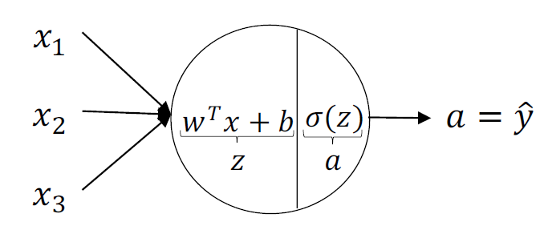

# Deep Neural Network
Python implementation of deep neural network  from scratch with a mathmatical approach.

## Table of contents:
1. Overview
2. Intializing paramaters
3. Forward propagation
4. Backward propagation
5. predict

## 1.Forward propagation :
Forward propagation is mainly broken into two steps:
1. linear forward (weighted sum input): 
    &ensp;calculating z = w.x + b  

2. activation: 
   &ensp;pluging z into the activation function sigmoid or relu ... 
    &ensp;A = g(z) 

 

For an L-layer model we commonly use the [relu activation function](https://en.wikipedia.org/wiki/Rectifier_(neural_networks)) for hidden layers neurons 
and [sigmoid activation function](https://en.wikipedia.org/wiki/Activation_function) for output layer in case of binary classification 
as it maps values to propablties between 0 and 1 
therefor:  
propabilty \> 0.5 = 1 , and propabilty \< 0.5 = 0  

In case of multi-class classification we use a [Softmax activation function](https://en.wikipedia.org/wiki/Softmax_function) in output layer 
which isn't implemented here and i will implement later. 

 

## Links :
* [loading data](https://github.com/Shehab-Mahmoud/DeepNeuralNetwork/blob/main/load_data.py)
* [neural network class](https://github.com/Shehab-Mahmoud/DeepNeuralNetwork/blob/main/DNN.py)